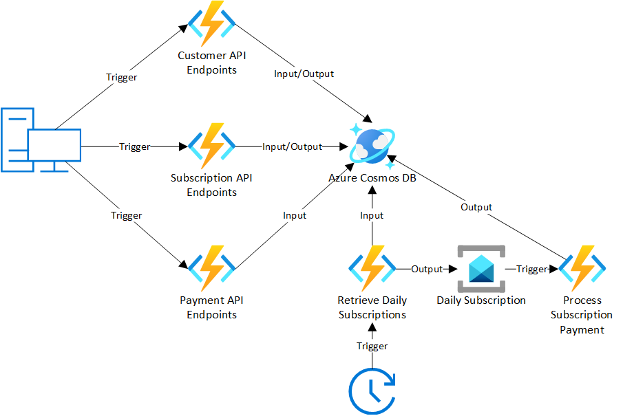

# Azure Functions

This is a set of Azure Functions demo applications that demostrate a real-world example. Each demo app has the same functionality but is written in a different language. The current languages are:

* [C#](csharp)
* [Java](java)

If you an example in a different language, please submit an GitHub issue to this repo.

## Overview
The demo app is a data pipeline that allows the creation of customers and subscriptions. On each day of the month, at midnight, all subscriptions for that day are retrieved and payments are processed.



## Running in Azure
To run this demo, you will need the following resources provisioned in Azure
* Storage Account
* Cosmos DB (Core/SQL API) with the following named Database and Containers (/partitionKey)
  * Sales
    * Customers (/id)
    * Subscriptions (/customerId)
    * Payments (/customerId)
* Service Bus with the following named Queue
  * subscription-payments
* Azure Functions App

## App Settings
If you are deploying to Azure, you will need to add the following App Settings to your Functions App:
* DatabaseName: Sales
* CosmosConnectionStr: ```[Cosmos_Connection_String]```
* ServiceBusConnectionStr: ```[Service_Bus_Connection_String]```
* PaymentQueue: subscription-payments